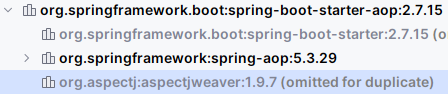
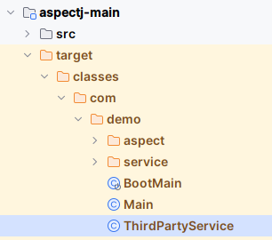

# java-aspectj

## How to run

* `mvn compile`
* RUN aspectj-main `com.demo.Main`

---

## AOP

### AOP 分类

* Spring AOP
* AspectJ

1、Spring AOP 需要结合 Spring 框架使用，且只能将切面织入 Spring IOC 容器中的 Bean，使用的是 JDK 动态代理。
2、AspectJ 无框架要求，只要引入 `aspectjrt` 和 `aspectjweaver` 两个依赖即可使用。

---

### 使用 Spring AOP

**注意**

在使用 Spring AOP 的时候会使用到 @Aspect/@Before/@After/@Around 等注解，这些注解来自 AspectJ。
> 可以这样认为，AspectJ 是 AOP 编程的老大哥，它提出概念，定义了一系列规定，并定义了对应的注解来方便切面编程的开发。
>
> Spring 站在 AspectJ 的基础上，集成了 AspectJ 的注解来进行注解驱动开发。可以看到引入 Spring AOP 依赖的同时也会引入 AspectJ：
>
> 
>
> 需要注意的是：Spring AOP 仅使用到了 AspectJ 的注解来作为标记，不是使用 AspectJ 来实现切面编程。

#### 编程式 Spring AOP

编程式 Spring AOP 主要继承了 `org.springframework.aop` 包下面的几个接口：

* MethodBeforeAdvice
* AspectJAfterAdvice
* AspectJAfterReturningAdvice
* AspectJAfterThrowingAdvice
* AspectJAroundAdvice
* …

实现编程式 Spring AOP 只需要继承/实现上述接口即可：

```java
public class MyBeforeAspect implements MethodBeforeAdvice {
    @Override
    public void before(Method method, Object[] args, Object target) throws Throwable {}
}
```

#### XML 配置 Spring AOP

> 不再展开

#### 注解式 Spring AOP

> 不再展开

---

### 使用 AspectJ AOP

使用 AspectJ AOP 分为两种方式：

* XML 配置+注解驱动开发；
* AspectJ 的 `.aj` 格式开发。

#### 注解驱动开发

0、使用 JDK 1.8；idea 安装 AspectJ 插件

1、引入依赖

```xml
<dependencies>
    <dependency>
        <groupId>org.aspectj</groupId>
        <artifactId>aspectjweaver</artifactId>
        <version>1.9.7</version>
    </dependency>

    <dependency>
        <groupId>org.aspectj</groupId>
        <artifactId>aspectjrt</artifactId>
        <version>1.9.7</version>
    </dependency>
</dependencies>
```

2、被切面类与切面类

```java
// 被切面类
public class UserService {
    public void test() {
        System.out.println("UserService#test");
    }
}

// 切面类
@Aspect
public class LogAspect {
    @Pointcut("execution(* com.demo.service.UserService.*(..))")
    public void userPointCut() {}

    @Before("userPointCut()")
    public void before() {
        System.out.println("log before");
    }
}
// Main
public class Main {
    public static void main(String[] args) {
        UserService user = new UserService();
        user.test();
    }
}
```

3、~~XML 配置 `META-INF/aop.xml`~~ 

> 配置了 `aspectj-maven-plugin` 插件后可以不需要 XML 配置。

```xml
<!DOCTYPE aspectj PUBLIC "-//AspectJ//DTD//EN" "https://www.eclipse.org/aspectj/dtd/aspectj.dtd">
<aspectj>
    <weaver options="-verbose">
        <!-- only weave classes in our application-specific packages -->
        <include within="com.demo.service.*"/>
    </weaver>

    <aspects>
        <!-- weave this aspect -->
        <aspect name="com.demo.aspect.LogAspect"/>
    </aspects>
</aspectj>
```

4、接下来运行 main 方法会发现无任何变化，切面未能成功织入。因为还需要一个 AspectJ 的 maven 插件。

```xml
<build>
    <plugins>
        <plugin>
            <groupId>org.codehaus.mojo</groupId>
            <artifactId>aspectj-maven-plugin</artifactId>
            <version>1.14.0</version>
            <configuration>
                <source>1.8</source>
                <target>1.8</target>
                <complianceLevel>1.8</complianceLevel>
                <encoding>UTF-8</encoding>
                <showWeaveInfo>true</showWeaveInfo>
                <detail>true</detail>
                <verbose>true</verbose>
                <Xlint>ignore</Xlint>
            </configuration>
            <executions>
                <execution>
                    <goals>
                        <goal>compile</goal>       <!-- use this goal to weave all your main classes -->
                        <goal>test-compile</goal>  <!-- use this goal to weave all your test classes -->
                    </goals>
                </execution>
            </executions>
        </plugin>
    </plugins>
</build>
```

5、运行之前需要使用 `mvn compile` 使用 `aspectj-maven-plugin` 编译代码，将切面织入。

在这个过程中会看到提示信息大概如下：

```
[INFO] --- aspectj:1.14.0:compile (default) @ aspectj-test ---
[INFO] Showing AJC message detail for messages of types: [error, warning, fail]
[INFO] Join point 'method-execution(void com.demo.service.UserService.test())' in Type 'com.demo.service.UserService' (UserService.java:4) advised by before advice from 'com.demo.aspect.LogAspect' (LogAspect.java:14)
[INFO] ------------------------------------------------------------------------
```

观察编译生成的 `UserService.class` 字节码文件：

```java
public class UserService {
    public UserService() {
    }
    public void test() {
        LogAspect.aspectOf().before(); // 切面方法成功织入
        System.out.println("UserService#test");
    }
}
```

可以发现切面方法织入成功。

6、运行 main 方法查看结果。

---

#### .aj 格式

0、idea 安装 AspectJ 插件

1、[AspectJ 语法](https://eclipse.dev/aspectj/doc/released/progguide/starting-development.html)

2、编写被切面类与切面类

```java
// 被切面类
public class UserService {
    public boolean pay(int amount) {
        System.out.println("UserService#pay(int)");
        return false;
    }
}

// 切面类
public aspect CheckAspect {
    // call 表示该切入点会在 UserService#pay(int) 方法在被调用的地方织入
    pointcut callPay(UserService userService):
        call(boolean UserService.pay(int)) && target(userService);

    // 切面表达式还可以使用第二种方式定义
    before(): execution(* com.demo.service.UserService.pay(..)) {
        System.out.println("CheckAspect before ==>");
    }
    
    after(UserService userService): callPay(userService) {
        System.out.println("CheckAspect after ==>");
    }
    

}
// Main
public class Main {
    public static void main(String[] args) {
        UserService user = new UserService();
        user.pay(100);
    }
}
```

3、配置 `aspectj-maven-plugin` 插件

4、`mvn compile` 编译

编译完成，查看 `UserService#pay(int)` 方法调用的位置：

```java
public static void main(String[] args) {
    UserService user = new UserService();
    byte var2 = 100;
    UserService var3 = user;

    try {
        var3.pay(var2);
    } catch (Throwable var5) {
        CheckAspect.aspectOf().ajc$after$com_demo_aspect_CheckAspect$1$2acf4bfd(user);
        throw var5;
    
    CheckAspect.aspectOf().ajc$after$com_demo_aspect_CheckAspect$1$2acf4bfd(user);
}
```

可以发现后置通知已经织入成功。

5、运行 main 方法查看结果。

…

---

上面两种开发方式切面类都是在编译时期织入的，称为 *Compile Time Weaving*。当我们需要修改第三方 jar 包中的类时，使用 CTW 织入就错过时机了。因为我们依赖的第三方 jar 包是经过编译后的，所以需要在不同的时期进行织入。

---

### Post-Compile Time Weaving

> 编译时织入，在 Java 源码被编译成 class files 之后，被 JVM 加载之前进行织入。

处理第三方 jar 包中的类就需要在编译后织入，只需要在原先的基础进行一些小改动即可。

0、找到织入位置，比如需要织入 `org.mybatis.spring.SqlSessionFactoryBean#buildSqlSessionFactory` 方法。

1、编写切面类

```java
public aspect MybatisAspect {
    before(): execution(* org.mybatis.spring.SqlSessionFactoryBean.buildSqlSessionFactory(..)) {
        System.out.println("MybatisAspect before ==>");
    }
}
```

2、修改 `pom.xml` 配置

```xml
<plugin>
    <groupId>org.codehaus.mojo</groupId>
    <artifactId>aspectj-maven-plugin</artifactId>
    <version>1.14.0</version>
    <configuration>
        <source>1.8</source>
        <target>1.8</target>
        <complianceLevel>1.8</complianceLevel>
        <encoding>UTF-8</encoding>
        <showWeaveInfo>true</showWeaveInfo>
        <detail>true</detail>
        <verbose>true</verbose>
        <Xlint>ignore</Xlint>
        <weaveDependencies> <!-- 指定需要织入的依赖 -->
            <weaveDependency>
                <groupId>org.mybatis</groupId>
                <artifactId>mybatis-spring</artifactId>
            </weaveDependency>
        </weaveDependencies>
    </configuration>
    <executions>
        <execution>
            <goals>
                <goal>compile</goal>       <!-- use this goal to weave all your main classes -->
                <goal>test-compile</goal>  <!-- use this goal to weave all your test classes -->
            </goals>
        </execution>
    </executions>
</plugin>
```

3、编译、运行、观察结果。

细心观察可以发现， 原本位于第三方 jar 包的类在使用 Post-Compile-Time Weaving 编译后出现到了当前 target 目录中：



…

---

### Load Time Weaving

> 加载时织入，在类被加载入 JVM 时进行织入。

Spring AOP 和 AspectJ 都支持 *Load Time Weaving* 加载时织入，同时它们都需要借助另外的 jar 包来实现：

* Spring AOP 需要借助 `spring-instrument-{version}.jar`，参考 [Spring AOP LTW](https://docs.spring.io/spring-framework/reference/core/aop/using-aspectj.html#aop-aj-ltw)。
* AspectJ  需要借助 `aspectjweaver-{version}.jar`，参考 [AspectJ LTW](https://eclipse.dev/aspectj/doc/released/devguide/ltw.html)。

---

## SpringBoot 与 AspectJ

在 SpringBoot 中使用 AOP 切面编程有两个关键的注解：

* `@EnableAspectJAutoProxy` 注解开启 AOP 注解驱动开发。
* `@EnableLoadTimeWeaving` 切换 AOP 切面织入时期，切换为加载时期织入。是否会切换到加载时期织入主要判断 `META-INF/aop.xml` 配置是否存在，存在则自动开启加载时期织入。

---

## 参考

* AspectJ 语法：https://eclipse.dev/aspectj/doc/released/progguide/starting-development.html
* AspectJ 开发指南：https://eclipse.dev/aspectj/doc/released/devguide/index.html
* https://www.baeldung.com/aspectj
* https://juejin.cn/post/6844903760347529224
* Spring AOP 开启 Load-Time-Weaving：https://docs.spring.io/spring-framework/reference/core/aop/using-aspectj.html#aop-aj-ltw